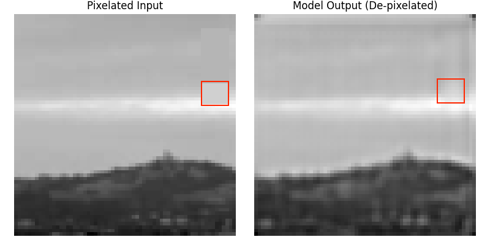
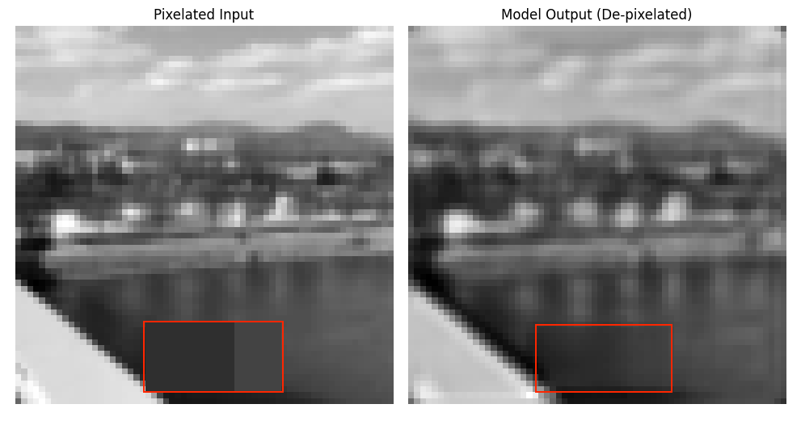
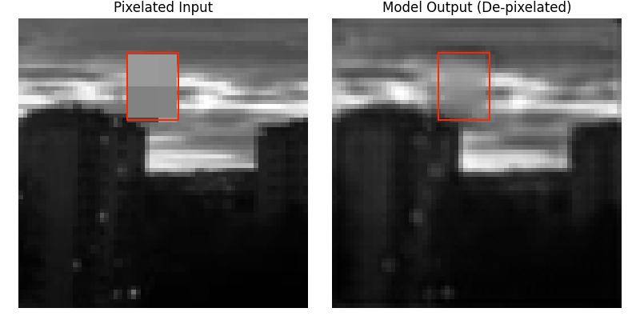

## Examples

| Pixelated Input | Model Output |
|---|---|
|  |  |

# un-pixelator

A Python project that pixelates images and trains a U-Net CNN to restore them.

## Requirements

- Python 3.12.1
- Install dependencies:

pip install -r requirements.txt

## Project Structure

ass1-ass5 — coursework building blocks (dataset, collate, models)
ass6/      — main training + inference code
ass6/best_model.pth — pre-trained model weights (ready to use)

## Run Inference (no training needed)

A pre-trained model is included. To visualize a pixelated vs restored image:

python ass6/results.py

This picks a random image from the dataset, pixelates it, and shows the model's reconstruction side by side.

## Training

Training images are not included (too large). If you have your own grayscale 64x64 images, place them in:

ass6/grey_training/

Then train via the training script in ass6/.

## Model

U-Net with 4 encoder blocks (64→128→256→512) and skip connections.
Input: 2-channel tensor (pixelated image + known pixel mask)
Output: 1-channel restored image